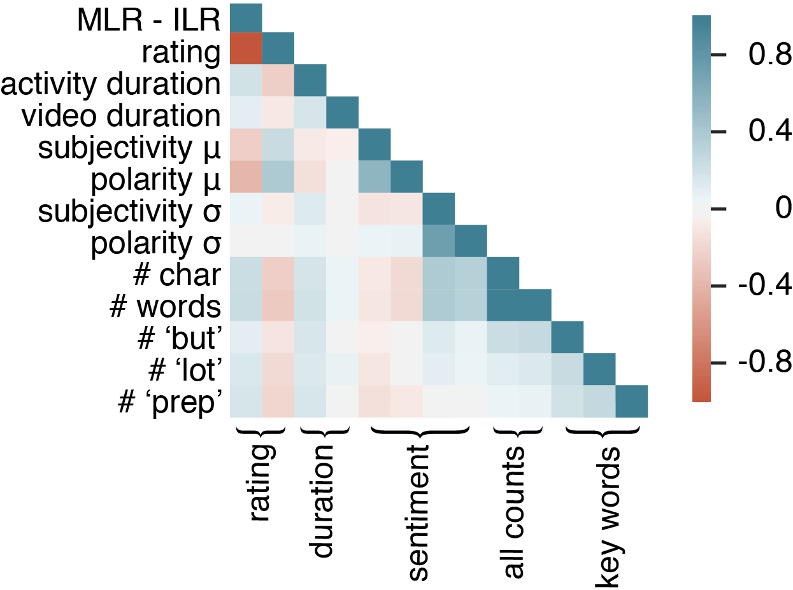

# By Madeleine Flint, Insight Data Science Fellow 
### Silicon Valley 2020A, draft post written 2020-02-05

## 1. Introduction
During my time as an Insight Data Science Fellow, I consulted with a startup (which I will call 'ElementarySTEM') that creates and distributes K-5 STEM educational content used in classrooms. I was thrilled to get the opportunity to help this company, as ElementarySTEM's mission hit close to home: I went to a small elementary school and learned science from an analog predecessor of their service (science in a box), and have spent the last several years working in the educational sector as a professor of structural engineering. If you want the short version of this story, you can find slides [here](http://bit.ly/Course_Correct).

ElementarySTEM has been dealing with an issue brought on by hard work and success: the scale of their customers and their feedback is growing much faster than that of their customer support teams and tools. The customer support team wants to respond in a timely fashion to customer feedback that identifies a problem with the service or content. However, the overwhelmingly positive feedback makes it difficult to identify problematic reviews. The support team need a solution to this problem that can help them prioritize their actions in responding to user feedback in the form of free text reviews.

My research has spanned scales from micro (transport in porous media) to macro (bridge networks), and I believed that my skills in problem definition and modeling would allow me to quickly scaffold a solution while gleaning useful insights along the way. I'm also someone for whom teaching demos tend to go awry, which I think gives me some empathy with my client's customers. As a bonus, I had past experience using regular expressions (regex) to work with messy text data. 


### 1.1 Problem formulation
The client had a strong intuition that their current approach to classifying reviews was underperforming, but had not had much time to dive into the data. From our discussions, I identified the following objectives. 

1. Characterize 3+ years of customer feedback and ~1 year of customer support data: how well is their system working, is anything being missed, etc.?
2. Improve, expand, or replace and existing<sup>*</sup> heuristic classifier to label reviews as related to new and as-yet-discovered topics.
3. Classify incoming review tickets as urgent or non-urgent, where "urgent" = high priority for customer support to look at and respond to the ticket.

<sup>*</sup>The existing tool was a hard-coded, hand-built decision tree, one branch of which fed into a keyword and rules-based multi-classifier.

### 1.2 Approach
#### Plans A, B, and C
With these objectives set, an initial exploration of the data available suggested that I augment the existing heuristic classifer with data from the client's customer relationship management (CRM) system to develop a labeled set for supervised classification of topics and/or urgency. Additional unsupervised learning (topic modeling and clustering) could generate features for either (A) an urgency classifer, (B) a multi-classifier using a flat structure (review &rarr;urgent-prep vs. &rarr;non-urgent-prep vs. &rarr;urgent-lesson length, &rarr;etc.), or (C) multi-classifier using a hierarchical structure (review&rarr;prep&rarr;urgent or &rarr;not urgent).

#### Plans D, E, F, ...
It became evident through further data exploration that there was very little reliable information to work with to use directly as supervised labels, or even to bootstrap to use transfer learning to infer labels. After many attempt to slice/merge/approach the data in a different manner, I took  a big step back towards using NLP and unsupervised methods to identify reliable trends that could either improve the existing heuristics or be used for supervised learning. In the end, I was able to do both, although for a limited number of topics and with limited fine-tuning.

### 1.3 How should success be measured?
In my original client interviews, my contact indicated that the customer support team would accept a high false positive rate (i.e., getting reviews flagged as topic-related and needing of attention even if they weren't actually about that topic), because the customer support team would not want to miss out on a potentially problematic review. In ML terms, this suggested that recall (detecting true positives) was more important than precision (rate of true positives amongst predicted positives). The commonly used F<sub>1</sub> score equally weights precision and recall, so a better combined measure would be the F<sub>2</sub> score, which doubles the weight on recall:

*F*<sub>2</sub> = ((1+2<sup>2</sup>)precision &times; recall)/(2<sup>2</sup>&times;precision + recall)

I also identified the miss rate (false negative rate) as a metric of interest, as unidentified problematic reviews would mean that dissatisfied teachers would not get a response (or it would be long in coming), and that feedback would not be integrated into future lesson revisions.


## 2. Data wrangling

### 2.1 Acquisition and preprocessing
The data came in with reasonable structure (CSVs) which could be merged on the review ID and lesson ID. Given that no one at my client's firm had looked at the data as a whole, basic exploration was an important first task. Plans A, B, and C went out the window when I was able to take a look at a few comments. The comments below are composites but illustrate the sort of quirks present in the data and the sorts of topics that had been auto-tagged by whatever version of the classifier was in use when the review came in.

* "It was a LOT of prep but worth it because the students had SO MUCH FUN!!! We used stirrers instead of straws and the activity worked just fine at less expense and better for &#x1F30E;&#x1F609;." **prep** / **materials expense**
* "The content was a little advanced for my firsties and the video freeezing didn't help--that was my fault though because I used an old browser." **tech:video**
* "I loved this lesson and so did the kiddos! It didn't hurt that we brought the school nurse in to give a demo." **safety**

In addition to missing possible topics of interest (if the lesson difficulty is appropriate for the grade; suggesting a different materials), there appeared to be a somewhat high false positive rate (the supplies had less expense; the school nurse was not brought in for safety reasons). While this behavior makes some sense given client needs at the time (erring on the side of caution; trying to identify the most urgent content as opposed to "tips"), *it meant that the existing labels could not be used as ground truth.*


### 2.2 Reproducing the existing classifier
When I attempted to reproduce the existing rules-based classifier I began to better understand the false positives and to begin to worry that a high false negative rate might also be present. For example, a set of rules might be:

* **Topic**: prep
* **All**: "prep"
* **Any**: "a lot, too much, difficult, Hurculean,..."
* **Not**: "easy, short, not much,..." 

In some cases, it was possible to imagine terms getting added over time as they popped up in individual reviews ("Hurculean"). As the rules were developed by humans over time, it's not too surprising that the resulting classification was overly restrictive/overfit, and caused a very high false negative rate. Also, even though my exploration of the data suggested that many reviews discussed multiple topics, there was not much overlap between topics even when they had common terms. A video, a lesson, or the prep could all be "too long", and yet the restrictive nature of the classifier meant that such reviews were frequently missed.

### 2.3 Feature selection and engineering
#### Non-text features
The non-text-based features included standarized metadata about the individual review, target audience, and lesson:

* **Rating** (`int`): Rating of individual lession by a customer based on a prompt given at the end of the lesson. The vast majority of ratings were high (4 or 5) and did not include a comment.
* **Lesson, unit, and grade range** (`categorical`/`ordinal`): Even the lessons which were known to sometimes cause problems tended to be rated very high.
* **Average rating** (`float`): Average across customers/sessions as stored in the CRM. The exact provenance of this score was unknown (does it lump revised and unrevised versions of lessons together?), and there was some concern about the data going stale.
* **Duration** (`timedelta`): expected length of the lesson, multimedia, and/or activities associated with a particular lesson. It was unclear to me how revised information was incorporated.


#### Text metadata / basic NLP
The `comment` (free text) field was expected to be the most important in identifying topics and urgency. The text metadata I considered as possible features were:

* **Counts**: 
	* **characters** (`int`): Client feedback suggested that long comments (>40-50 words) were meaningfully different, i.e., more likely to provide interesting or urgent feedback.
	* **words** (`int`): A possible alternative to character counts, could be more stable across the writing styles of different reviewers.
	* **sentences** (`int`): A more intuitive descriptor for the amount of content present in the comment, but potentially noisy due to differences in punctuation across reviews.
	* **special punctuation** (i.e., '!' or '?') (`int`): Linked to sentiment but faster to process.
	* **parts of speech** (i.e., verb, noun) (`int`): Possibly characteristic of sentiment or content, e.g., perhaps a "suggestion" might have more nouns than a "kudos" review.
* **Topic keywords** (`int`/`bool`): Either counts or presence/absence of a keyword. Keywords could be inferred either from the existing heuristic, from topic modeling, from data exploration, or a combination of these strategies. See Section 
* **Sentiment** (`float`): depending on package used, could be polarity/subjectivity or positivity/negativity/neutrality/compound.

#### Engineered features
I intuited that variance from the norm or within comments might be a strong predictor of problematic feedback given that reviews and ratings were generally very favorable. Potential engineered features I considered were:

* **Difference from average lesson rating, MLR-ILR** (`float`/`bool`): as all lessons had very high average ratings, the difference between a review and the average might indicate something about the urgency of that review. I implemented a simple difference; a more sophisticated metric might be the number of standard deviations from the mean.
* **Difference from average teacher rating** (`float`/`bool`): the 1-5 star ratings are subjective, and rating value might become more meaningful if put into the context of the teacher's normal rating.
* **Sentence-level sentiment** (`float`): a measure of the standard deviation of sentiment might see through the "criticism sandwich" effect, and the mean would equalize across a more rational unit of thought (i.e., the sentence as opposed to the word).

I also considered using more advanced NLP strategies, such as word embeddings, but ultimately decided that this approach was impractical for implementation, because the pipeline complexity would be expected to grow significantly and the model would become more likely to become stale. However, data exploration suggested that many reviews would start and/or end with a positive sentiment but include some criticism in between. 

## 3. Modeling: from topic clusters to classifier
### 3.1 Bag of words NLP
After removing or converting tabs, newlines, and single quotes, I ran the corpus through scikit-learn's `CountVectorizer`. The word counts from my initial clustering and classification model runs were obtained using the following vectorization.

```
cv = CountVectorizer(	max_df       = 0.85,
			stop_words   = 'english',
			min_df       = 0.01,
			ngram_range  = (1,2),
			max_features = 200	)               
```

This would convert a string like:

```
Soo fun

I really liked the lesson. I didn't do the whole thing, though .
```
 to:
 
 `Soo fun I really liked the lesson . I didn t do the whole thing , though .`

I also explored custom stop word lists, expanded ngram ranges, and other tweaks to the basic NLP approach.

### 3.2 All things clusters
As is common in data science projects, the real story of my iterative modeling over the last three weeks is both looping and branching (i.e., not easily representable in the linear format required by a blog post). In the end, the clustering methods I used did not provide. That said, I thought others might benefit from learning about how naive implementations of various clustering methods did or did not work for this data set, and am including some notes that I took along the way.

| Method  | Why | Test Run  | Scaled Run | Full Run | Notes |
| ------------- | ------------- | ------------- | ------------- | ------------- | ------------- | 
 **LDA** topic model on **comment bag of words** | Commonly used topic model; bag of words requires least effort in pre-processing; potential to identify keywords to be used later. | **10k comments** returned ambiguous or overlapping clusters, i.e., they were all "great", "fun",...| **10k 1/2/3-star comments** had better segmentation but the topics were not interpretable to expected clusters and insensitive to settings for max/min vocabulary.| **10k 1/2/3-star comments, custom stop words** returned some clear topics, but nothing new. Topic clarity was highly dependent on topic number. | Results were lackluster, leading me to look into semi-supervised methods to seed clusters or use a hierarchical clustering model. |
**DBSCAN** clustering on **comment metadata** + **review features** using cosine similarity. | Faster than hierarchical; good for noisy data; selects its own number of clusters; high-dimensional data OK. | **2k rich metadata + features** clustered the reviews into 'short positive/neutral', 'short negative', and 'long' clusters, which was sufficiently promising for me to continue. | **10k metadata + features** worked well even without part-of-speech data, producing 6 clusters with some segmentation into positive/negative, video errors, and lesson-specific. | **100k metadata + features** did not scale from prior promising results: clusters very small compared to noise. | Text data is clearly important but without some secret key I wasn't able to unlock the potential for unsupervised methods. |

### 3.3 Translating clustered topics to a multi-topic classifier
In the end, the topic modeling and clustering had only an indirect route influence on my proposed solutions to the client's problem. To generalize, I used insights dervied from unsupervised learning to:

* confirm the suggestions of my client regarding main categories of feedback
* situate my exploration of individual comments in a broader context
* confirm that reviews contained mixed topics
* create a schematic/matrix for types of feedback
* select a set of core topics for development of an improved classifier.

In the interests of making sure I was able to deliver value to my client, I decided to go with a tried and true approach (another rules-based decision tree!) that would use regex to bypass some of the issues related to the current approach. I expanded the topic set from the original 9 to 16, which better reflected what I discovered during the unsupervised data modeling. A slightly simplifed but representative example of the improvement (in Python-flavored regex) would be:

* **Topic**: prep: volume
* **All**: `"prep.*"`
* **Any**: `"(\b[^(not)] a lot\b)|(\b[^(not)] too m.*\b)|(\bhurcule.*\b)|..."`

Python's `re` package unfortunately does not support an `and` regex, meaning that each topic would require two passes of the string with a `True` return (yes, I could do more with lookaheads or lookbehinds and I do not claim that such a regex call is in any way optimized). That said, running the full set on a given comment would take at most 30 ms (on my 7-year-old computer), and 10,000 comments could be analyzed in 7 minutes. Through a few rounds of tweaking, I was able to tag topics to about 10&times; as many reviews as the original heuristic classifier.


As shown in the Venn diagram, my approach also identified more reviews with overlapping or multiple topics.

### 3.4 Single-topic classification using machine learning
While the "improved" regex-based decision tree might be a reasonable interim solution, it is still completely human-designed, and unable to adapt to new data.  The "prep" category had a reasonable amount of tagged tickets in both the original and new decision tree, and I selected it to build a single-topic classifier that would hopefully be more robust in the future.

Trial runs used varying numbers of features and word counts, and counts of "but" and "lot" regularly came in very high in the importance rankings. Following this lead, I reran my bag-of-words analysis, and ended up with this call to obtain a bag of words that included "prep":

```
cv = CountVectorizer(	max_df       = 0.87,  
			stop_words   = None,  
			min_df       = 0.0001,  
			ngram_range  = (1,1),  
			max_features = 130   )                
```

The limited feature set I used for model comparison and evaluation included the features shown in this correlation plot. Here the sentiment features (i.e., TextBlob's polarity) are obtained as statistics (mean, *&mu;* and standard deviation *&sigma;*) over values obtained for each sentence within a comment. The heatmap reveals some high correlations within categories, which would warrant further exploration before model deployment.



The scikit-learn binary classifiers I evaluated were:

* Decision Tree: why not try an ML version of a heuristic model?
* Random Forest: if a tree, why not a forest? This model was alo suggested by the client, might pick up more subtle signals in the data, and would be less prone to overfitting even with a large feature set.
* Gradient Boosting: another ensemble/tree method that tends to run faster than Random Forests.

## 4. Validation
### 4.1 Multi-topic improved heuristic classifier (overall)
I ran my recreation of the original DT/heuristic classifier as well as my improved version on the full review set (some 200K comments). As shown in the chart below, the improved classifier (bottom) tags a significantly higher number of reviews, while providing more fine-grained detail of the review content. I analyzed the reviews with tagged topics and found that the intersection of topics tagged by both DTs was much smaller than the union, indicating that much of the growth was coming from newly identified topics. Half of the comments originally put into the "long" bucket were still unassigned to a topic, which also suggests the need for further investigation.


To validate the overall performance against some form of ground truth, I randomly selected 200 reviews with comments and tagged them according to an expanded framework. Of these, a little under 20% were related to some topic that was not "kudos", i.e., 2x the number identified by the improved DT but 15x the number identified by the original DT. I interpret this result to mean that there is more room for improvement but that my DT is at least identifying the correct order of magnitude of potentially problematic feedback.

### 4.2 Heuristic classification comparison for "prep"
To further validate the classifiers and prepare to use supervised learning approaches, I created a customized sampling technique to obtain ground truth for comments indicating that the volume of teacher prep required was too high. Selection of reviews for validation loosely used a stratified sampling technique inspired by a confusion matrix, as shown below. The sampling schema was intended to develop a training dataset likely to produce both type I and type II errors.


520 comments have been analyzed as of the time of this blog post. These steps yielded a fairly balanced set of ~190 true positives (strictly on prep volume), ~50 ambiguous positives (about prep but could be material volume instead of time; these were treated as negatives in the ML classification), and ~280 true negatives (not related to prep at all or stating that the prep was easy/short). Evaluation of the improved and original multi-topic classifiers found reasonable precision at the expense of sub-optimal recall and miss rate.

| Metric | Improved heuristic | Original heuristic |
| ------ | ----- | -----|
| Precision | 0.8 | 0.9 |
| Recall | 0.6-0.8 | 0.5-0.7 |
| F<sub>2</sub> | 0.7-0.8  | 0.5-0.8|
| Miss rate | 0.15-0.3 | 0.25-0.4 |
| Total classified | ~300* | ~400 |
| Number of sub-topics | 4* | 1 |
*>7000 if the 5th cluster of 'activity tip' is considered. 


### 4.2 Single-topic ML classifier
I built various versions of three machine learning binary classifiers, evaluating them with a 10-fold cross-validation and an 80/20 train/test split. Performance of the algorithms in terms of F<sub>2</sub>, miss rate, fitting time, etc., varied significantly depending on what features were selected. The figure below is representative of the sort of range shown, and was obtained using a limited set of rating/NLP features as well as categorical variables (one-hot-encoded) for the lesson ID and grade range.


As expected, the ensemble methods had better performance overall.

## 5. Conclusions
### 5.1 Recommendations to client
I made several recommendations to build a roadmap to improved classification of incoming reviews:

* Consider employing improved decision tree to aid customer support team: the regex-based tree runs quickly and classifies many more reviews across more topics.
* Use the sampling scheme to build a larger training data set within the CRM.
* Periodically re-run the provided Jupyter notebook to assess the new decision tree's performance, identify new topics, and evaluate binary classifiers against the collected ground truth. 

### 5.2 Recommendations to my future self (or you!)

* The NLP/unsupervised clustering pathway can take a lot of time, and results are uncertain. It would have been better to take a few hours to label entries earlier on so that supervised methods could be pursued in tandem with unsupervised approaches. 
* Learning a version control method for models/Jupyter might have been a worthwhile investment.

### 5.3 Next steps and impact
My consulting project identified a serious flaw in my client's current approach to handling free-text customer feedback, and proposed a quick and easy interim solution that can support the development of a more general long-term strategy. My preliminary exploration of long-term solutions  suggested that most ensemble binary classifier can be expected to work well, allowing my client's data science and engineering team to choose an option that they feel has the best tradeoffs between deployment, stability, and speed. Should one of my models or engineered features be of interest, I would caution the team to check for stale data related to averaged ratings and the creep of feedback as new content is added and lessons are revised. Regardless of what they choose, I hope that the analysis I provided will give them a head start on improving their workflow for handling free-text feedback.

## Acknowledgements
Many thanks to my contact at ElementarySTEM, who was generous in sharing their time and expertise. I would also like to thank the many great folks who put their project and code snippets online. I pulled code snippets and techniques liberally from the following sources:

* Yuwen Wu on her [github repo](https://github.com/yuwie10/cultivate)
*  Emmanuel Ameisen on [KDnuggets](https://www.kdnuggets.com/2019/01/solve-90-nlp-problems-step-by-step-guide.html)
*  Adam Geitgay on [Medium](https://medium.com/@ageitgey/text-classification-is-your-new-secret-weapon-7ca4fad15788)
* Jonathan Oheix on [Towards Data Science](https://towardsdatascience.com/detecting-bad-customer-reviews-with-nlp-d8b36134dc7e)
* Marc Kelechava on [Towards Data Science](https://towardsdatascience.com/unsupervised-nlp-topic-models-as-a-supervised-learning-input-cf8ee9e5cf28)
* Alind Gupta on [Geeks for Geeks](https://www.geeksforgeeks.org/implementing-dbscan-algorithm-using-sklearn/)

And, as always, thank you to the generous folks at Insight (mentors, directors, and fellows) for their highly effective suggestions and encouragement along the way.
